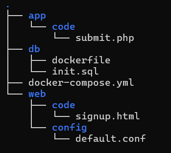
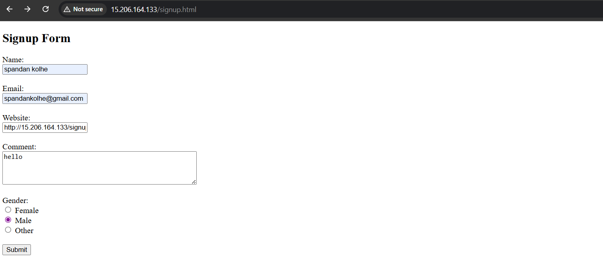
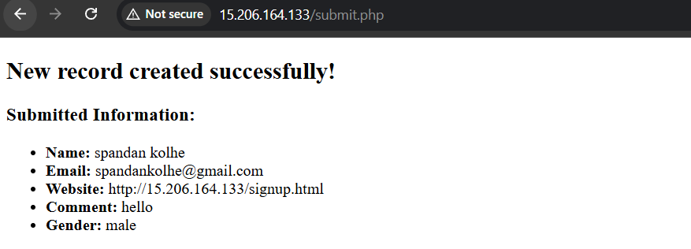

# Dockerized Three Tier Web Application

## Project Overview

This project is a simple implementation of three tier architecture using docker compose.
I have created three separate layers:

* Web layer using nginx (serves html page)
* Application layer using php-fpm (handles backend logic)
* Database layer using mysql (stores data)

The main idea of this project is to understand how different services run in separate containers and communicate with each other using docker networks.

---

## Architecture Flow

User -> Nginx (web) -> PHP (app) -> MySQL (db)

* User opens browser and accesses the application
* Nginx serves the signup form
* When user submits form, request goes to php container
* PHP processes data and connects to mysql
* Data gets stored in database
* Response is shown back to user

---

## Project Structure

---

## What I Learned

* How to create multi container application using docker compose
* How to connect containers using networks
* How nginx forwards request to php-fpm
* How backend connects to database using service name
* How volumes are used for persistent storage

---

## Prerequisites

Make sure below things are installed:

* Docker
* Docker Compose

To check:
docker --version
docker compose version

---

## Steps to Run the Project

1. Clone the repository

git clone https://github.com/spandankolhe/docker-three-tier-app.git

2. Go inside project folder

cd docker-three-tier-app

3. Start the containers

docker compose up -d

4. Check running containers

docker ps

5. Open browser

http://localhost

(or use your server IP if running on remote server)

---

## Outputs

---

## How It Works Internally

* Nginx container runs on port 80
* It loads signup.html
* PHP requests are forwarded to app container (port 9000)
* PHP connects to database using hostname "db"
* MySQL container initializes database using init.sql
* Data is stored in docker volume

---

## Stop the Project

docker compose down

---

## Notes

* Database data is stored in volume, so it will not be deleted after container stop
* If you want fresh database, remove volume:

docker compose down -v

---

## Author

Spandan Kolhe
